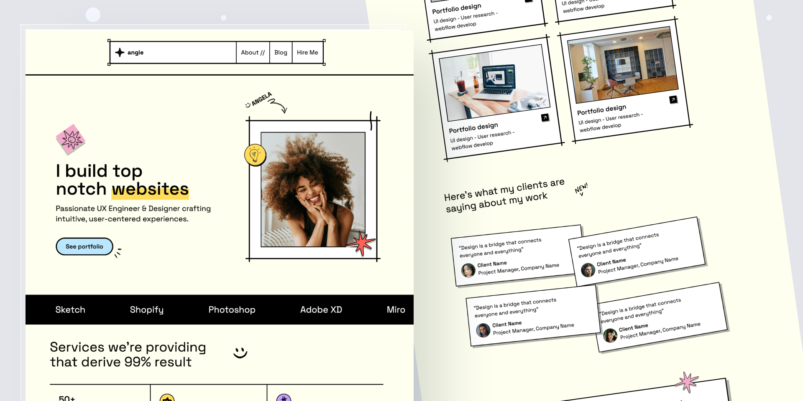

# mduo.cloud

我的第一次 Web 博客实践，采用 `ANGIE` 模板改造而成

ANGIE is a sleek Astro portfolio template built for creatives and developers. Featuring responsive layouts, customizable sections, and a bold brutalist design, it’s made to help you stand out and showcase your work with style.

ANGIE 是一款简洁的 Astro 作品集模板，专为创意人士和开发者打造。它采用响应式布局、可自定义的版块以及大胆的硬派风格设计，旨在帮助您脱颖而出，以时尚的方式展示您的作品。

| Command         | Action                                      |
| :-------------- | :------------------------------------------ |
| `npm install`   | Installs dependencies                       |
| `npm run dev`   | Starts local dev server at `localhost:4321` |
| `npm run build` | Build your production site to `./dist/`     |
